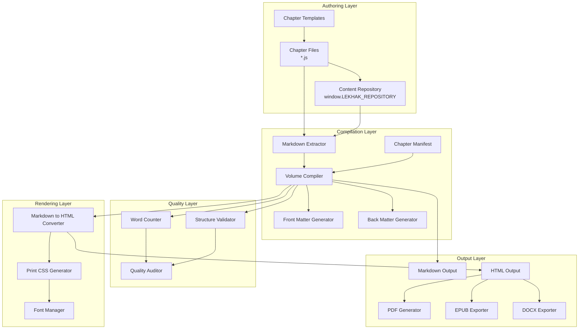

# Design Document: Book-Writing System

## Overview

The Book-Writing System is a comprehensive authoring and publishing toolchain integrated into Kiro IDE that enables authors to write, compile, and publish multi-volume book projects. The system follows a code-first authoring approach where book chapters are stored as JavaScript files with embedded markdown content in template literals, then compiled into multiple output formats (Markdown, HTML, PDF) suitable for publishing platforms like Amazon KDP.

### Design Philosophy

The system is built on three core principles:

1. **Code-First Authoring**: Chapters are JavaScript files, enabling authors to leverage version control (Git), syntax highlighting, code editor features, and collaborative workflows while writing prose.

2. **Separation of Content and Presentation**: Markdown content is stored separately from compilation logic, allowing the same content to be rendered in multiple formats with different styling.

3. **Quality-Driven Workflow**: Automated auditing, validation, and word count tracking ensure every chapter meets publishing standards before compilation.

### Target Users

- Technical authors writing programming books, tutorials, and documentation
- Educators creating bilingual educational content (e.g., Hindi-English language learning materials)
- Content creators managing multi-volume book series with consistent structure
- Publishers requiring print-ready PDFs with professional typography

### Key Features

- JavaScript-based chapter files with embedded markdown in template literals
- Multi-volume project management with independent configurations
- Markdown extraction engine with robust pattern matching
- HTML conversion with print-optimized CSS for A4 layout
- Bilingual content support (Devanagari + Latin scripts)
- Automated quality auditing (word counts, structure validation)
- Front matter and back matter generation
- Real-time preview with live reload
- Multiple export formats (MD, HTML, PDF, EPUB, DOCX)

## Architecture

### High-Level Architecture

The Book-Writing System follows a pipeline architecture with four main stages:

```
┌─────────────────┐
│  Chapter Files  │  (JavaScript with embedded markdown)
│  v1_ch1_*.js    │
└────────┬────────┘
         │
         ▼
┌─────────────────┐
│   Extraction    │  (Regex-based markdown extraction)
│     Engine      │
└────────┬────────┘
         │
         ▼
┌─────────────────┐
│   Compilation   │  (Manifest-driven chapter ordering)
│     Engine      │
└────────┬────────┘
         │
         ▼
┌─────────────────┐
│    Rendering    │  (Markdown → HTML + CSS)
│     Engine      │
└────────┬────────┘
         │
         ▼
┌─────────────────┐
│  Output Files   │  (MD, HTML, PDF)
│  manuscript_*.* │
└─────────────────┘
```

### Component Architecture



### System Layers

#### 1. Authoring Layer
- **Chapter Files**: JavaScript files containing markdown in template literals
- **Chapter Templates**: Predefined structures for consistent chapter organization
- **Content Repository**: Global object storing all chapter content indexed by keys

#### 2. Compilation Layer
- **Markdown Extractor**: Regex-based engine that extracts markdown from template literals
- **Chapter Manifest**: Ordered list defining which chapters belong to each volume
- **Volume Compiler**: Orchestrates the compilation process for a single volume
- **Front/Back Matter Generators**: Create title pages, copyright, TOC, afterword

#### 3. Rendering Layer
- **Markdown to HTML Converter**: Transforms markdown syntax to HTML elements
- **Print CSS Generator**: Creates A4-optimized stylesheets for print/PDF
- **Font Manager**: Handles web font loading for bilingual content

#### 4. Quality Layer
- **Word Counter**: Counts words across both Devanagari and Latin scripts
- **Structure Validator**: Checks for required sections and valid markdown syntax
- **Quality Auditor**: Generates reports on word counts, structure, and standards compliance

#### 5. Output Layer
- **Markdown Output**: Raw concatenated markdown for all chapters
- **HTML Output**: Print-ready HTML with embedded CSS
- **PDF Generator**: Browser-based or headless Chrome PDF generation
- **EPUB/DOCX Exporters**: Alternative format converters

### Data Flow

1. **Authoring Phase**: Author writes chapters as JavaScript files with markdown in template literals
2. **Extraction Phase**: Compiler reads chapter files and extracts markdown content using regex patterns
3. **Assembly Phase**: Compiler orders chapters according to manifest and concatenates content
4. **Generation Phase**: Front matter and back matter are generated with metadata
5. **Conversion Phase**: Markdown is converted to HTML with appropriate styling
6. **Validation Phase**: Quality auditor checks word counts and structure
7. **Output Phase**: Final files are written to output directory

### Technology Stack

- **Runtime**: Node.js (for compilation scripts)
- **File System**: Node.js `fs` module for reading/writing files
- **Pattern Matching**: JavaScript regex for markdown extraction
- **Styling**: CSS3 with print media queries and web fonts
- **Fonts**: Google Fonts (Noto Serif Devanagari, Source Serif 4, Inter)
- **PDF Generation**: Browser print API or Puppeteer (headless Chrome)
- **Version Control**: Git-friendly plain text JavaScript files

## Components and Interfaces

### 1. Chapter File Component

**Purpose**: Store book chapters as JavaScript files with embedded markdown content.

**File Structure**:
```javascript
if (typeof window !== 'undefined') {
  window.LEKHAK_REPOSITORY = window.LEKHAK_REPOSITORY || {};
}

/**
 * Volume X, Chapter Y: Title
 * TARGET: 10,000+ words
 * Pedagogy: Contrastive Linguistics, Deep Theory, Examples, Error Lab
 */

window.LEKHAK_REPOSITORY["v1_c1"] = `
# Chapter Title in Hindi
## Chapter Title in English

[Markdown content here...]
`;
```

**Naming Convention**: `v{volume}_ch{number}_{topic}.js` or `v{volume}_bonus{number}_{topic}.js`

**Interface**:
- Input: Author writes markdown content within template literal
- Output: JavaScript file with valid syntax and properly closed template literal
- Validation: Must contain `LEKHAK_REPOSITORY` assignment with template literal

### 2. Markdown Extraction Engine

**Purpose**: Extract markdown content from JavaScript chapter files reliably.

**Algorithm**:
```
1. Read JavaScript file content as string
2. Search for pattern: LEKHAK_REPOSITORY[...] = `
3. Find opening backtick position after equals sign
4. Scan backward from end of file to find closing backtick
5. Extract substring between opening and closing backticks
6. Fallback: Search for .content = ` pattern
7. Fallback: Find largest backtick-delimited block > 1000 chars
8. Return extracted markdown or throw error
```

**Interface**:
```javascript
function extractMarkdown(jsContent: string): string
```

**Input**: JavaScript file content as string
**Output**: Extracted markdown content as string
**Errors**: Throws error if no valid template literal found

**Edge Cases**:
- Escaped backticks within content (`\``)
- Multiple template literals in same file
- Comments containing backticks
- Nested template literals

### 3. Chapter Manifest

**Purpose**: Define the order and metadata of chapters in a volume.

**Data Structure**:
```javascript
const CHAPTER_MANIFEST = [
  {
    file: 'v1_ch1_alphabet.js',
    num: '1',
    title: 'अंग्रेज़ी वर्णमाला',
    titleEn: 'The English Alphabet',
    type: 'core'
  },
  {
    file: 'v1_bonus1_modal_concord.js',
    num: 'B1',
    title: 'Modal Auxiliaries',
    titleEn: 'Modal Auxiliaries',
    type: 'bonus'
  }
];
```

**Fields**:
- `file`: Filename of chapter (must exist in chapters directory)
- `num`: Chapter number (string, e.g., "1", "B1")
- `title`: Chapter title in primary language (e.g., Hindi)
- `titleEn`: Chapter title in English
- `type`: Chapter type ("core" or "bonus")

**Interface**:
- Input: Array of chapter metadata objects
- Output: Ordered list for compilation
- Validation: All files must exist, numbers must be unique

### 4. Volume Compiler

**Purpose**: Orchestrate the compilation process for a single volume.

**Main Function**:
```javascript
function compileVolume(config: VolumeConfig): CompilationResult
```

**Configuration**:
```javascript
interface VolumeConfig {
  author: string;
  bookTitle: string;
  bookSubtitle: string;
  volume: string;
  edition: string;
  publisher: string;
  cefr: string;
  year: string;
  chaptersDir: string;
  outputDir: string;
  chapterManifest: ChapterMetadata[];
}
```

**Process**:
1. Validate configuration
2. Create output directory if needed
3. For each chapter in manifest:
   - Read chapter file
   - Extract markdown content
   - Count words
   - Store in chapters array
4. Generate front matter
5. Generate table of contents
6. Concatenate all chapter content
7. Generate back matter
8. Write markdown output
9. Convert to HTML
10. Apply print CSS
11. Write HTML output
12. Run quality audit
13. Return compilation result

**Output**:
```javascript
interface CompilationResult {
  success: boolean;
  totalWords: number;
  totalChapters: number;
  outputFiles: {
    markdown: string;
    html: string;
  };
  auditResults: AuditReport;
  errors: string[];
}
```

### 5. Markdown to HTML Converter

**Purpose**: Convert markdown syntax to HTML elements.

**Interface**:
```javascript
function markdownToHTML(markdown: string): string
```

**Conversion Rules**:
- `# text` → `<h1>text</h1>`
- `## text` → `<h2>text</h2>`
- `### text` → `<h3>text</h3>`
- `#### text` → `<h4>text</h4>`
- `**text**` → `<strong>text</strong>`
- `*text*` → `<em>text</em>`
- `` `text` `` → `<code>text</code>`
- `> text` → `<blockquote><p>text</p></blockquote>`
- `---` → `<hr>`
- `- item` → `<li>item</li>` (wrapped in `<ul>`)
- `1. item` → `<li>item</li>` (wrapped in `<ol>`)
- Tables with pipe syntax → `<table>` with `<thead>` and `<tbody>`

**Processing Order**:
1. Escape HTML entities (&, <, >)
2. Convert headings (must be before bold/italic)
3. Convert bold and italic
4. Convert inline code
5. Convert blockquotes
6. Convert horizontal rules
7. Convert tables
8. Convert lists
9. Wrap consecutive list items in ul/ol
10. Convert paragraphs (double newline)

### 6. Print CSS Generator

**Purpose**: Generate CSS optimized for A4 print layout and PDF generation.

**Interface**:
```javascript
function getPrintCSS(): string
```

**Key Specifications**:
- Page size: A4 (210mm × 297mm)
- Margins: 2.5cm top/bottom, 2cm right, 2.5cm left (binding gutter)
- Base font: 11pt with line-height 1.75
- Fonts: Noto Serif Devanagari, Source Serif 4, Inter
- Heading sizes: h1 (22pt), h2 (16pt), h3 (13pt), h4 (11pt)
- Page breaks: `page-break-before: always` for chapters
- Table styling: Borders, alternating rows, `page-break-inside: avoid`
- Blockquote styling: Background color, left border, italic
- Code styling: Monospace font, background color

**Media Queries**:
- `@media screen`: Centered container with shadow for preview
- `@media print`: Hide screen-only elements (toolbar, navigation)

### 7. Word Counter

**Purpose**: Count words in markdown content across multiple scripts.

**Interface**:
```javascript
function countWords(text: string): number
```

**Algorithm**:
```
1. Split text on whitespace characters (space, tab, newline, carriage return)
2. Filter out empty strings
3. Return count of remaining tokens
```

**Considerations**:
- Counts words in both Devanagari and Latin scripts
- Does not exclude markdown syntax (headers, bold, etc.)
- Simple whitespace-based tokenization

### 8. Quality Auditor

**Purpose**: Validate manuscript quality against publishing standards.

**Interface**:
```javascript
function runAudit(chapters: Chapter[], config: AuditConfig): AuditReport
```

**Checks**:
1. **Word Count**: Compare each chapter against target threshold (default: 9000 words)
2. **Structural Elements**: Check for presence of Error Lab, Practice exercises, Hindi-English contrast, Section headers
3. **Front Matter**: Verify title page, copyright, TOC, preface, dedication
4. **Print Formatting**: Verify page size, margins, typography, chapter breaks

**Output**:
```javascript
interface AuditReport {
  allPass: boolean;
  totalWords: number;
  chapterResults: ChapterAuditResult[];
  structuralChecks: StructuralCheckResult[];
  frontMatterChecks: FrontMatterCheckResult[];
  printFormattingChecks: PrintFormattingCheckResult[];
}
```

### 9. Front Matter Generator

**Purpose**: Generate professional front matter for the book.

**Interface**:
```javascript
function generateFrontMatter(config: VolumeConfig): string
```

**Components**:
1. **Title Page**: Book title, subtitle, volume, CEFR level, author, edition, publisher
2. **Copyright Page**: Copyright notice, year, author, edition, language, target audience, ISBN placeholder
3. **Dedication**: Bilingual dedication text
4. **Preface**: Book purpose, features, usage instructions
5. **Table of Contents**: Chapter list with titles, word counts, separated by type (core/bonus)

**Output**: Markdown string containing all front matter sections

### 10. Back Matter Generator

**Purpose**: Generate closing content for the book.

**Interface**:
```javascript
function generateBackMatter(config: VolumeConfig): string
```

**Components**:
1. **Afterword**: Summary of what was learned, preview of next volume
2. **Author Bio**: Information about the author
3. **Copyright Footer**: Final copyright notice

**Output**: Markdown string containing all back matter sections

## Data Models

### Chapter

```javascript
interface Chapter {
  file: string;           // Filename (e.g., "v1_ch1_alphabet.js")
  num: string;            // Chapter number (e.g., "1", "B1")
  title: string;          // Title in primary language
  titleEn: string;        // Title in English
  type: 'core' | 'bonus'; // Chapter type
  content: string;        // Extracted markdown content
  words: number;          // Word count
}
```

### VolumeConfig

```javascript
interface VolumeConfig {
  author: string;         // Author name
  bookTitle: string;      // Book title (primary language)
  bookSubtitle: string;   // Book subtitle (English)
  volume: string;         // Volume designation (e.g., "Volume 1: Foundation")
  edition: string;        // Edition (e.g., "First Edition, 2026")
  publisher: string;      // Publisher name
  cefr: string;           // CEFR level (e.g., "A1–A2")
  year: string;           // Publication year
  chaptersDir: string;    // Path to chapters directory
  outputDir: string;      // Path to output directory
  chapterManifest: ChapterMetadata[];
}
```

### ChapterMetadata

```javascript
interface ChapterMetadata {
  file: string;           // Filename
  num: string;            // Chapter number
  title: string;          // Title in primary language
  titleEn: string;        // Title in English
  type: 'core' | 'bonus'; // Chapter type
}
```

### CompilationResult

```javascript
interface CompilationResult {
  success: boolean;       // Overall success status
  totalWords: number;     // Total word count across all chapters
  totalChapters: number;  // Total number of chapters
  outputFiles: {
    markdown: string;     // Path to markdown output
    html: string;         // Path to HTML output
  };
  auditResults: AuditReport;
  errors: string[];       // List of errors encountered
}
```

### AuditReport

```javascript
interface AuditReport {
  allPass: boolean;       // True if all checks passed
  totalWords: number;     // Total word count
  chapterResults: ChapterAuditResult[];
  structuralChecks: StructuralCheckResult[];
  frontMatterChecks: FrontMatterCheckResult[];
  printFormattingChecks: PrintFormattingCheckResult[];
}
```

### ChapterAuditResult

```javascript
interface ChapterAuditResult {
  chapterNum: string;     // Chapter number
  words: number;          // Word count
  targetWords: number;    // Target word count
  gap: number;            // Difference from target
  status: 'PASS' | 'NEAR' | 'LOW'; // Status indicator
  hasErrorLab: boolean;   // Error Lab present
  hasPractice: boolean;   // Practice exercises present
  hasContrast: boolean;   // Hindi-English contrast present
  hasSections: boolean;   // Section headers present
}
```

### StructuralCheckResult

```javascript
interface StructuralCheckResult {
  checkName: string;      // Name of the check
  pattern: RegExp;        // Regex pattern to match
  passed: boolean;        // Check result
}
```

### ContentRepository

```javascript
interface ContentRepository {
  [key: string]: string;  // Chapter key → markdown content
}

// Global instance
window.LEKHAK_REPOSITORY: ContentRepository;
```

### PrintCSSConfig

```javascript
interface PrintCSSConfig {
  pageSize: string;       // e.g., "A4"
  margins: {
    top: string;          // e.g., "2.5cm"
    right: string;
    bottom: string;
    left: string;
  };
  fonts: {
    primary: string;      // e.g., "Noto Serif Devanagari"
    secondary: string;    // e.g., "Source Serif 4"
    mono: string;         // e.g., "Consolas"
  };
  baseFontSize: string;   // e.g., "11pt"
  lineHeight: number;     // e.g., 1.75
  colors: {
    primary: string;      // e.g., "#1A237E"
    secondary: string;
    text: string;
    background: string;
  };
}
```

